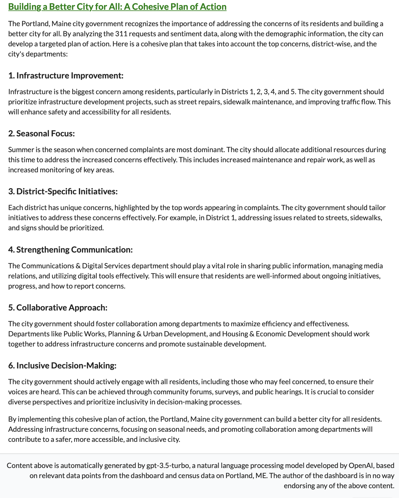

```{r setup, include=FALSE}
knitr::opts_chunk$set(collapse = TRUE)
```

How can we use data to visualize the heartbeat of a city? The answer lies in a unique blend of analytics and insight.

For the past several weeks, I've investigated and visualized a city's [311 requests](https://en.wikipedia.org/wiki/3-1-1) as part of my degree coursework on interactive dashboards. These requests cover a range of non-urgent issues, from public roads and services to violations, disputes, and more. Admittedly, this dataset is a narrow window into a city and its heartbeat, but it has served to illustrate how a larger, more comprehensive dataset might present a deeper understanding of city dynamics.

For those interested, the end result is live on shinyapps: [*Pulse of Portland*](https://ehringhaus.shinyapps.io/project/). For more information, continue reading.

<figure>
  
  <figcaption style="color:grey; text-align:center; font-size: small;">A top to bottom glimpse at the [Pulse of Portland](https://ehringhaus.shinyapps.io/project/) dashboard.</figcaption>
</figure>

## Literature Review

I first aimed to find examples of cities using data to better themselves. A compelling [article](https://medium.com/challenges-to-democracy/customer-driven-government-how-to-listen-learn-and-leverage-data-for-service-delivery-6d3732d96e48) by Jane Wiseman titled "Customer-Driven Government: How to Listen, Learn, and Leverage Data for Service Delivery" provides an insightful analysis of how customer feedback data is harnessed to improve government services. For instance:

- **Kansas City, Missouri**. Every 311 interaction is a data point, a measure of the quality of services delivered by the city. The city's response to low citizen satisfaction ratings on snow removal was to launch a media blitz, educating residents on what to expect and providing real-time updates for the public to track snowplows using GPS data.

- **Santa Monica, California**. The city has developed the innovative [Wellbeing Index](https://www.civicwellbeing.org), integrating survey data, administrative data, and social media data into a comprehensive local index to enhance citizen welfare.

As we transition into the design choices for my own proof-of-concept city dashboard, these examples form a foundation for our understanding of how data can be used to reveal the inner workings of a city.

## Design Choices: Sentiment Analysis and Beyond

For constructing the dashboard, I turned to [Shiny](https://www.shinyapps.io) and [Rhino](https://appsilon.github.io/rhino/). Rhino is an R package designed to build high-quality, enterprise-grade Shiny applications.

Designing it, I aimed to animate a triad of interconnected elements:

1. **Sentiment Analysis**: I wanted to understand the feelings and experiences of Portland residents. I conducted sentiment analysis on the complaints and categorized them to map the sentiment landscape of the city.

2. **Word Frequencies and District Segmentation**: I linked the sentiments to the specific words used in the complaints, revealing themes across districts. This allowed for a deeper dive into the district-specific narratives, highlighting the predominant issues resonating within each sentiment category and district.

To back these insights, I created interactive visualizations to track trends over time and space, using a geospatial map built with [Leaflet](https://rstudio.github.io/leaflet/) of actual complaints and a seasonal and year-by-year heat map of counts of those complaints.

3. **AI Generated Recommendations**: To further the journey from observation to insight, I introduced a *very* proof-of-concept feature: AI-Generated Recommendations. This tool employs [gpt 3.5-turbo](https://platform.openai.com/docs/models/gpt-3-5) by OpenAI, feeding it the dashboard's current state (i.e., user selections and summary statistics) along with citywide [Census QuickFacts](https://www.census.gov/quickfacts/fact/table/portlandcitymaine/PST045222) to return an easily digestible report, a quick snapshot of what citymakers should consider when addressing the community's needs.

<figure style="display: flex; flex-direction: column; align-items: center; justify-content: center; text-align: center;">
  
  <figcaption style="color:grey; font-size: small;">An example of an "AI-Generated Recommendations" report</figcaption>
</figure>

No paradigm shifts will be found here. Yet, following advice as simple as, "clean up the streets," could lead to a significant increase in resident satisfaction.

## Conclusion: The Lifeblood of a City in the Age of Data

Data is a seed from which knowledge grows. But much like a seed, data in its raw form isn't particularly useful. This project is a testament to the power of visualization and its potential to uncover the intricate dynamics of a city. It demonstrates that even with a restricted dataset and a tight timeframe, we can extract valuable insights about a city and its residents. The [*Pulse of Portland*](https://ehringhaus.shinyapps.io/project/) dashboard is a tangible embodiment of this concept, a proof-of-concept that brings us closer to understanding the city's rhythm.

The journey ahead is exciting. We are not just creating smarter cities; we are creating cities that listen, understand, and respond. We are crafting cities that truly serve their residents, cities that pulse with the rhythm of their people.